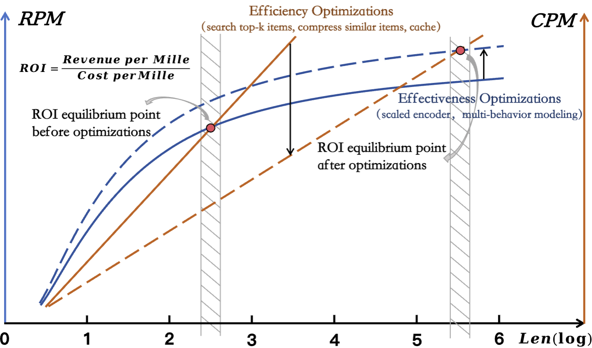
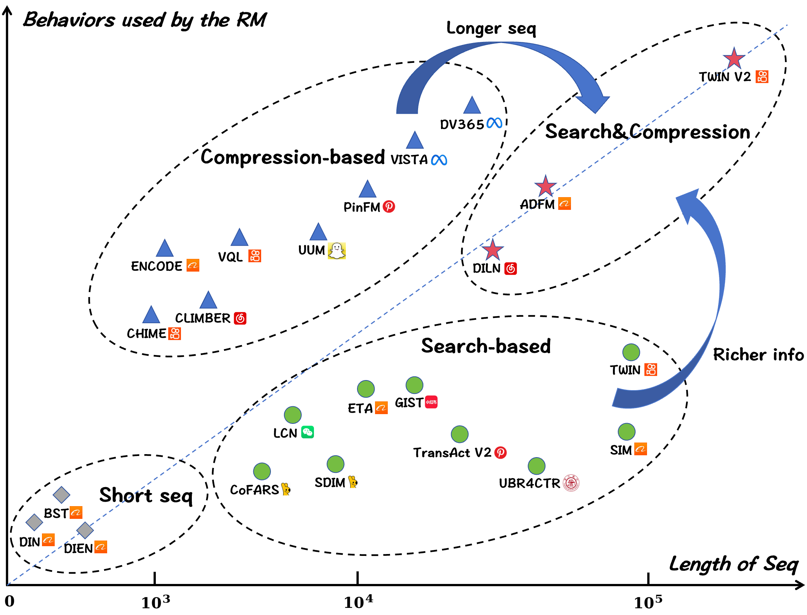

# A Survey of User Lifelong Behavior Modeling: Perspectives on Efficiency and Effectiveness

## Overview
This is the official repository of the paper ["*A Survey of User Lifelong Behavior Modeling: Perspectives on Efficiency and Effectiveness*"](https://www.preprints.org/manuscript/202601.1559)

This survey provides an in-depth examination of existing User Lifelong Behavior Modeling (ULBM) methods from an industrial perspective, with a particular focus on their performance under the efficiency–effectiveness balance, aiming to sustain a stable return on investment (ROI) as user lifelong behavior sequences continue to grow.

We will continue to track and summarize emerging ULBM research, with particular attention to approaches that have been validated in real-world industrial settings, in order to facilitate the continued advancement of this field.

## Citation
If you find this survey useful, please cite the following paper:

```bibtex
@article{zhou2026survey,
  title={A Survey of User Lifelong Behavior Modeling: Perspectives on Efficiency and Effectiveness},
  author={Zhou, Rui and Jia, Qinglin and Chen, Bo and Xu, Peng and Sun, Yijia and Lou, Siyuan and Fu, Chaoxin and Fu, Mengyuan and Shen, Guoming and Zhou, Zheli and others},
  year={2026},
  publisher={Preprints}
}
```


## Table of Contents
- [Introduction](#introduction)
- [Survey Scope](#survey-scope)
- [Efficiency-Effectiveness Balance](#efficiency-effectiveness-balance)
  - [Efficiency Optimizations](#efficiency-optimizations)
    - [Algorithmic](#algorithmic)
    - [Infrastructure](#infrastructure)
  - [Effectiveness Optimizations](#effectiveness-optimizations)
- [Papers](#papers)
- [Datasets](#datasets)
- [Acknowledgement](#acknowledgement)
- [How to Contribute](#how-to-contribute)

## Introduction
User Lifelong Behavior Modeling (ULBM) aims to capture users’ long-term and continuously evolving preferences by leveraging their lifelong interaction histories. Owing to its defining characteristics, including ultra-long behavior sequences and heterogeneous user actions, deploying ULBM in industrial recommender systems poses substantial challenges in balancing efficiency and effectiveness, which is critical for sustaining a stable return on investment (ROI) as user behavior sequences continue to grow.

This survey examines ULBM approaches from two complementary perspectives: efficiency-aware designs, which emphasize algorithmic and engineering optimizations to improve scalability, and effectiveness-oriented modeling strategies, which focus on enhancing representation capacity through expressive interaction modeling, fine-grained interest mining, and the incorporation of external knowledge. In addition, we summarize representative datasets for ULBM evaluation to provide practical guidance and support future research.

Through this survey, we aim to provide researchers and practitioners with a comprehensive set of insights and practical references, and to stimulate further exploration of scalable and effective ULBM solutions under real-world constraints.

The shift of the ROI equilibrium point in industrial scenarios




## Survey Scope
This survey covers a wide range of topics relevant to ULBM, including:
- Ultra-long sequence modeling.
- Heterogeneous behavior modeling.
- Industrial deployment under the efficiency–effectiveness balance (EEB).

## Efficiency-Effectiveness Balance

### Efficiency Optimizations

#### Algorithmic

ULBM commonly adopts a two-stage paradigm of *preprocess first, encode later* to reduce the scale of user behavior sequences and achieve a balance between efficiency and effectiveness. This paradigm can be further categorized into search-based methods and compression-based methods. In this context, the *General Search Unit* (GSU) and the *Interest Reduction Unit* (IRU) serve as key components for improving efficiency.

Trend chart of existing ULBM work on algorithmic optimizations:



#### Infrastructure
Industrial-scale ULBM faces strict latency and throughput requirements due to ultra-long sequences, persistent user states, and frequent online inference. Infrastructure optimizations aim to increase throughput, reduce GPU memory and storage, and shorten response time. These optimizations can be categorized into three main types: *custom kernels*, *precision optimization*, and *multi-level caching*.

The infrastructure optimizations of ULBM can be organized along three dimensions:


### Effectiveness Optimizations
Effectiveness in ULBM refers to improving the quality of user representations by addressing key limitations: summarizing long-term interactions may lose critical dependencies, overlapping behaviors introduce noise, and relying solely on observed actions limits semantic understanding.  
To tackle these challenges, effectiveness optimizations focus on three main directions: *advancing interaction modeling*, *fine-grained user interest understanding*, and *incorporating external knowledge*.

The effectiveness optimizations of ULBM can be characterized along three dimensions:


## Papers
We provide a curated collection of references related to ULBM, including: short-sequence modeling, search-based methods, compression-based methods, Hybrid methods, End-to-End methods, Methods on heterogeneous user behaviors, Methods on user interest, Methods on incorporation of external knowledge.

- **Short-sequence Modeling:** Early and foundational methods that provide essential modeling principles for capturing user preferences through short-term interaction dynamics.

|  Method   |                                             Paper Title                                              |   Published At    |
| :-------: | :--------------------------------------------------------------------------------------------------: | :---------------: |
| *GwEN* |      [Deep Neural Networks for YouTube Recommendations](https://static.googleusercontent.com/media/research.google.com/zh-CN//pubs/archive/45530.pdf)      | RecSys'16 |
| *DIN* |      [Deep Interest Network for Click-Through Rate Prediction](https://arxiv.org/abs/1706.06978)      | KDD'18 |
| *DIEN* |      [Deep Interest Evolution Network for Click-Through Rate Prediction](https://arxiv.org/abs/1809.03672)      | AAAI'19 |
| *BST* |      [Behavior Sequence Transformer for E-commerce Recommendation in Alibaba](https://arxiv.org/abs/1905.06874)      | KDD'19 |


- **Search-based Methods:** Methods that enhance both efficiency and modeling effectiveness by searching behavior subsets most relevant to the current context from long user interaction histories.

|  Method   |                                             Paper Title                                              |   Published At    |
| :-------: | :--------------------------------------------------------------------------------------------------: | :---------------: |
| *SIM* |      [Search-based User Interest Modeling with Lifelong Sequential Behavior Data for Click-Through Rate Prediction](https://arxiv.org/abs/2006.05639)      | CIKM'20 |
| *TWIN* |      [TWIN: TWo-stage Interest Network for Lifelong User Behavior Modeling in CTR Prediction at Kuaishou](https://arxiv.org/abs/2302.02352)      | KDD'23 |
| *TransAct V2* |      [TransAct V2: Lifelong User Action Sequence Modeling on Pinterest Recommendation](https://arxiv.org/abs/2506.02267)      | CIKM'25 |
| *DARE* |      [Long-Sequence Recommendation Models Need Decoupled Embeddings](https://arxiv.org/abs/2410.02604)      | ICLR'25 |
| *MARM* |      [MARM: Unlocking the Future of Recommendation Systems through Memory Augmentation and Scalable Complexity](https://arxiv.org/abs/2411.09425)      | CIKM'25 |
| *GIST* |      [GIST: Cross-Domain Click-Through Rate Prediction via Guided Content-Behavior Distillation](https://arxiv.org/abs/2507.05142)      | arXiv'25 |
| *LCN* |      [Cross Domain LifeLong Sequential Modeling for Online Click-Through Rate Prediction](https://arxiv.org/abs/2312.06424)      | KDD'24 |
| *LIC* |      [Long-Term Interest Clock: Fine-Grained Time Perception in Streaming Recommendation System](https://arxiv.org/abs/2501.15817)      | WWW'25 |
| *MIRRN* |      [Multi-granularity interest retrieval and refinement network for long-term user behavior modeling in ctr prediction](https://arxiv.org/abs/2411.15005)      | KDD'25 |
| *LongRetriever* |      [LongRetriever: Towards Ultra-Long Sequence based Candidate Retrieval for Recommendation](https://arxiv.org/abs/2508.15486)      | arXiv'25 |
| *ETA* |      [End-to-End User Behavior Retrieval in Click-Through RatePrediction Model](https://arxiv.org/abs/2108.04468)      | arXiv'21 |
| *SDIM* |      [Sampling Is All You Need on Modeling Long-Term User Behaviors for CTR Prediction](https://arxiv.org/abs/2205.10249)      | CIKM'22 |
| *CoFARS* |      [Context-based Fast Recommendation Strategy for Long User Behavior Sequence in Meituan Waimai](https://arxiv.org/abs/2403.12566)      | WWW'24 |
| *UBR4CTR* |      [User Behavior Retrieval for Click-Through Rate Prediction](https://arxiv.org/abs/2005.14171)      | SIGIR'20 |
| *QIN* |      [Query-dominant User Interest Network for Large-Scale Search Ranking](https://arxiv.org/abs/2310.06444)      | CIKM'23 |
| *MUSE* |      [MUSE: A Simple Yet Effective Multimodal Search-Based Framework for Lifelong User Interest Modeling](https://arxiv.org/abs/2512.07216)      | arXiv'25 |


- **Compression-based Methods:** Methods that transform long behavior sequences into a limited number of compact representations to support scalable and effective user modeling.

|  Method   |                                             Paper Title                                              |   Published At    |
| :-------: | :--------------------------------------------------------------------------------------------------: | :---------------: |
| *DV365* |      [DV365: Extremely Long User History Modeling at Instagram](https://arxiv.org/abs/2506.00450)      | KDD'25 |
| *ULIM* |      [User Long-Term Multi-Interest Retrieval Model for Recommendation](https://arxiv.org/abs/2507.10097)      | RecSys'25 |
| *PinFM* |      [PinFM: Foundation Model for User Activity Sequences at a Billion-scale Visual Discovery Platform](https://arxiv.org/abs/2507.12704)      | RecSys'25 |
| *LREA* |      [LREA: Low-Rank Efficient Attention on Modeling Long-Term User Behaviors for CTR Prediction](https://arxiv.org/abs/2503.02542)      | SIGIR'25 |
| *HiT-LBM* |      [Hierarchical Tree Search-based User Lifelong Behavior Modeling on Large Language Model](https://arxiv.org/abs/2505.19505)      | SIGIR'25 |
| *Climber* |      [An Efficient Large Recommendation Model: Towards a Resource-Optimal Scaling Law](https://arxiv.org/abs/2502.09888)      | CIKM'25 |
| *VQL* |      [VQL: An End-to-End Context-Aware Vector Quantization Attention for Ultra-Long User Behavior Modeling](https://arxiv.org/abs/2508.17125)      | arXiv'25 |
| *ENCODE* |      [ENCODE: Breaking the Trade-Off Between Performance and Efficiency in Long-Term User Behavior Modeling](https://arxiv.org/abs/2508.13567)      | TKDE'25 |
| *Trinity* |      [Trinity: Syncretizing Multi-/Long-tail/Long-term Interests All in One](https://arxiv.org/abs/2402.02842)      | KDD'24 |
| *UUM* |      [Learning Universal User Representations Leveraging Cross-domain User Intent at Snapchat](https://arxiv.org/abs/2504.21838)      | SIGIR'25 |
| *DMQN* |      [Deep Multiple Quantization Network on Long Behavior Sequence for Click-Through Rate Prediction](https://arxiv.org/abs/2508.20865)      | SIGIR'25 |
| *DiffuMin* |      [Modeling Long-term User Behaviors with Diffusion-driven Multi-interest Network for CTR Prediction](https://arxiv.org/abs/2508.15311)      | RecSys'25 |
| *CHIME* |      [CHIME: A Compressive Framework for Holistic Interest Modeling](https://arxiv.org/abs/2504.06780)      | arXiv'25 |
| *MIMN* |      [Practice on Long Sequential User Behavior Modeling for Click-Through Rate Prediction](https://arxiv.org/abs/1905.09248)      | KDD'19 |
| *CAIN* |      [Context-Aware Lifelong Sequential Modeling for Online Click-Through Rate Prediction](https://arxiv.org/abs/2502.12634)      | arXiv'25 |
| *VISTA* |      [Massive Memorization with Hundreds of Trillions of Parameters for Sequential Transducer Generative Recommenders](https://arxiv.org/abs/2510.22049)      | arXiv'25 |
| *DGIN* |      [Deep Group Interest Modeling of Full Lifelong User Behaviors for CTR Prediction](https://arxiv.org/abs/2311.10764)      | arXiv'23 |


- **Hybrid Methods:** Approaches that combine retrieval-based and compression-based strategies to balance efficiency and effectiveness when modeling ultra-long user behavior sequences. Here, *C+S* means compression first,search later and *S+C* means search first,compression later.

|  Method   |                                             Paper Title                                              |   Published At    |
| :-------: | :--------------------------------------------------------------------------------------------------: | :---------------: |
| *ADFM<sub>C+S<sub>* | [Adversarial Filtering Modeling on Long-term User Behavior Sequences for Click-Through Rate Prediction](https://arxiv.org/abs/2204.11587) | SIGIR'22 |
| *HBM<sub>C+S<sub>* | [Hierarchical User Long-term Behavior Modeling for Click-Through Rate Prediction](https://dl.acm.org/doi/10.1145/3726302.3730207) | SIGIR'25 |
| *TWIN V2<sub>C+S<sub>* | [TWIN V2: Scaling Ultra-Long User Behavior Sequence Modeling for Enhanced CTR Prediction at Kuaishou](https://arxiv.org/abs/2407.16357) | CIKM'24 |
| *DMGIN<sub>C+S<sub>* | [DMGIN: How Multimodal LLMs Enhance Large Recommendation Models for Lifelong User Post-click Behaviors](https://arxiv.org/abs/2508.21801) | arXiv'25 |
| *DILN<sub>S+C<sub>* | [Interest Changes: Considering User Interest Life Cycle in Recommendation Systems](https://arxiv.org/abs/2505.08471) | SIGIR'25 |


- **End-to-End Methods:** Approaches that directly model ultra-long user behavior sequences in a unified framework without explicit preprocessing, enabling holistic preference learning.

|  Method   |                                             Paper Title                                              |   Published At    |
| :-------: | :--------------------------------------------------------------------------------------------------: | :---------------: |
| *STCA* |      [Make It Long, Keep It Fast: End-to-End 10k-Sequence Modeling at Billion Scale on Douyin](https://arxiv.org/abs/2511.06077)      | arXiv'25 |
| *LONGER* |      [LONGER: Scaling Up Long Sequence Modeling in Industrial Recommenders](https://arxiv.org/abs/2505.04421)      | RecSys'25 |
| *HSTU* |      [Actions Speak Louder than Words: Trillion-Parameter Sequential Transducers for Generative Recommendations](https://arxiv.org/abs/2402.17152)      | ICML'24 |
| *MTGR* |      [MTGR: Industrial-Scale Generative Recommendation Framework in Meituan](https://arxiv.org/abs/2505.18654)      | CIKM'25 |
| *GenRank* |      [Towards Large-scale Generative Ranking](https://arxiv.org/abs/2505.04180)      | arXiv'25 |
| *Fuxi-α* |      [FuXi-α: Scaling Recommendation Model with Feature Interaction Enhanced Transformer](https://arxiv.org/abs/2502.03036)      | WWW'25 |


- **Methods on heterogeneous user behaviors:** Approaches that explicitly model multiple types of user actions to capture diverse preference signals and their interactions within user behavior sequences.

|  Method   |                                             Paper Title                                              |   Published At    |
| :-------: | :--------------------------------------------------------------------------------------------------: | :---------------: |
| *GNMR* |      [Multi-Behavior Enhanced Recommendation with Cross-Interaction Collaborative Relation Modeling](https://arxiv.org/abs/2201.02307)      | ICDE'21|
| *MB-CGCN* |      [ Multi-Behavior Recommendation with Cascading Graph Convolution Networks ](https://arxiv.org/abs/2303.15720)      | WWW'23 |
| *MB-GMN* |      [Graph Meta Network for Multi-Behavior Recommendation  ](https://arxiv.org/abs/2110.03969)      | SIGIR'21 |
| *MBGCN* |      [Multi-behavior Recommendation with Graph Convolutional Networks](https://dl.acm.org/doi/10.1145/3397271.3401072)      | SIGIR'20 |
| *CRGCN* |      [Cascading Residual Graph Convolutional Network for Multi-Behavior Recommendation](https://dl.acm.org/doi/10.1145/3587693)      | TOIS'23 |
| *CML* |      [Contrastive Meta Learning with Behavior Multiplicity for Recommendation](https://arxiv.org/abs/2202.08523)      | WSDM'22 |
| *CMBR* |      [Controllable Multi-Behavior Recommendation for In-Game Skins with Large Sequential Model](https://dl.acm.org/doi/10.1145/3637528.3671572)      | KDD'24 |


- **Methods on user interest:** Approaches that represent users with multiple interest vectors to capture diverse and evolving preferences within user behavior sequences.

|  Method   |                                             Paper Title                                              |   Published At    |
| :-------: | :--------------------------------------------------------------------------------------------------: | :---------------: |
| *MIND* |      [Multi-Interest Network with Dynamic Routing for Recommendation at Tmall](https://arxiv.org/abs/1904.08030)      | CIKM'19 |
| *ComiRec* |      [Controllable Multi-Interest Framework for Recommendation](https://arxiv.org/abs/2005.09347)      | KDD'20 |
| *OnePiece* |      [OnePiece: Bringing Context Engineering and Reasoning to Industrial Cascade Ranking System](https://arxiv.org/abs/2509.18091)      | arXiv'25 |
| *ReaRec* |      [Think Before Recommend: Unleashing the Latent Reasoning Power for Sequential Recommendation](https://arxiv.org/abs/2503.22675)      | arXiv'25 |


- **Methods on incorporation of external knowledge:** Approaches that enhance user representation by incorporating external knowledge sources to enrich semantic understanding beyond observed behaviors.

|  Method   |                                             Paper Title                                              |   Published At    |
| :-------: | :--------------------------------------------------------------------------------------------------: | :---------------: |
| *KGCL* |      [Knowledge Graph Contrastive Learning for Recommendation](https://arxiv.org/abs/2205.00976)      | SIGIR'22 |
| *KMCLR* |      [Knowledge enhancement for contrastive multi-behavior recommendation](https://arxiv.org/abs/2301.05403)      | WSDM'23 |
| *Eager* |      [Eager: Two-stream generative recommender with behavior-semantic collaboration](https://arxiv.org/abs/2406.14017)      | KDD'24 |
| *ReLLa* |      [Rella: Retrieval-enhanced large language models for lifelong sequential behavior comprehension in recommendation](https://arxiv.org/abs/2308.11131)      | WWW'24 |
| *ReLLaX* |      [Full-stack optimized large language models for lifelong sequential behavior comprehension in recommendation](https://arxiv.org/abs/2501.13344)      | TORS'25 |
| *KAR* |      [Towards Open-World Recommendation with Knowledge Augmentation from Large Language Models](https://arxiv.org/abs/2306.10933)      | RecSys'24 |
| *LIBER* |      [LIBER: Lifelong User Behavior Modeling Based on Large Language Models](https://arxiv.org/abs/2411.14713)      | arXiv'24 |
| *OneRec-Think* |      [OneRec-Think: In-Text Reasoning for Generative Recommendation](https://arxiv.org/abs/2510.11639)      | arXiv'25 |
| *RecZERO* |      [Think before recommendation: Autonomous reasoning-enhanced recommender](https://arxiv.org/abs/2510.23077)      | NIPS'25 |


## Datasets
We summarize representative datasets for evaluating ULBM methods, covering ultra-long behavior sequences, heterogeneous user actions, and realistic industrial settings.

| Dataset | #Users | #Items | #Interactions | Avg. Length | #Behavior Types |
|:--|--:|--:|--:|--:|--:|
| [*Amazon Books*](https://nijianmo.github.io/amazon/index.html) | 694,897 | 686,623 | 10,053,086 | 14.47 | 5 |
| [*MovieLens-1M*](https://grouplens.org/datasets/movielens/1m/) | 6,040 | 3,416 | 999,611 | 165.50 | 5 |
| [*MovieLens-20M*](https://grouplens.org/datasets/movielens/20m/) | 138,493 | 26,744 | 20,000,263 | 144.41 | 5 |
| [*Taobao*](https://tianchi.aliyun.com/dataset/dataDetail?dataId=649) | 987,994 | 4,162,024 | 100,150,807 | 101.37 | 4 |
| [*Tmall*](https://tianchi.aliyun.com/dataset/dataDetail?dataId=42) | 424,170 | 1,090,390 | 54,925,331 | 129.49 | 4 |
| [*Alibaba*](https://tianchi.aliyun.com/dataset/dataDetail?dataId=56) | 1,141,729 | 461,527 | 700,000,000 | 613.11 | 4 |
| [*KuaiRand-Pure*](https://kuairand.com/) | 27,285 | 7,551 | 1,436,609 | 52.65 | 7 |
| [*KuaiRand-1K*](https://kuairand.com/) | 1,000 | 4,369,953 | 11,713,045 | 11,713.05 | 7 |
| [*KuaiRand-27K*](https://kuairand.com/) | 27,285 | 32,038,725 | 322,278,385 | 11,811.56 | 7 |
| [*KuaiRec-Small*](https://kuairec.com/) | 1,411 | 3,327 | 4,676,570 | 3,314.37 | 1 |
| [*KuaiRec-Big*](https://kuairec.com/) | 7,176 | 10,728 | 12,530,806 | 1,746.21 | 1 |
| [*KuaiSAR-S*](https://kuaisar.github.io/) | 25,877 | 3,026,189 | 5,059,169 | 195.51 | 4 |
| [*KuaiSAR-R*](https://kuaisar.github.io/) | 25,877 | 4,046,367 | 14,605,716 | 564.43 | 4 |
| [*KuaiSAR-all*](https://kuaisar.github.io/) | 25,877 | 6,890,707 | 19,664,885 | 759.94 | 4 |
| [*TenRec-QK-video*](https://tenrec0.github.io/) | 5,022,750 | 3,753,436 | 493,458,970 | 98.24 | 4 |
| [*TenRec-QK-article*](https://tenrec0.github.io/) | 1,325,838 | 220,122 | 46,111,728 | 34.78 | 6 |
| [*TenRec-QB-video*](https://tenrec0.github.io/) | 34,240 | 130,637 | 2,442,299 | 71.33 | 4 |
| [*TenRec-QB-article*](https://tenrec0.github.io/) | 24,516 | 7,355 | 348,736 | 14.22 | 1 |
| [*Yambda-50M*](https://huggingface.co/datasets/yandex/yambda) | 10,000 | 934,057 | 48,000,000 | 4,800.00 | 5 |
| [*Yambda-500M*](https://huggingface.co/datasets/yandex/yambda) | 100,000 | 3,004,578 | 480,000,000 | 4,800.00 | 5 |
| [*Yambda-5B*](https://huggingface.co/datasets/yandex/yambda) | 1,000,000 | 9,390,623 | 4,800,000,000 | 4,800.00 | 5 |


## Acknowledgement
This research was conducted as a collaboration between University of Science and Technology of China and Kuaishou Technology.
<table>
  <tr>
    <td align="center"><br /><sub><b>University of Science and Technology of China</b></sub></td>
    <td align="center"><br /><sub><b>Kuaishou Technology</b></sub></td>
  </tr>
</table>

## How to Contribute
We welcome contributions from the community! If you have suggestions, improvements, or want to add papers to the reading list, feel free to submit an issue on [GitHub Issues](https://github.com/Kuaishou-RecModel/Survey_of_ULBM/issues).

